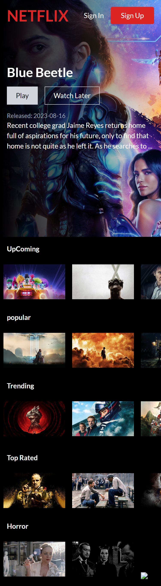

## Overview
### This project is a Netflix clone built with React, Tailwind CSS, and Firebase. It allows users to sign up or sign in using their Google account, and authenticated users can store and manage their favorite movies in their account.

## Features
* User Authentication: Users can sign up or sign in using their Google account.
* Movie Storage: Authenticated users can store and manage their favorite movies in their account.
* Responsive Design: The application is built with React for a dynamic and responsive user interface.

## Technologies Used
* React: A JavaScript library for building user interfaces.
* Tailwind CSS: A utility-first CSS framework for styling React components.
* Firebase: A comprehensive mobile and web app development platform that provides authentication and a real-time database (Firestore).

## screenshots
  

  

## Links
[Live](https://netflic-clone-dp.netlify.app/) 
[Repository](https://github.com/Dachi-Papashvili88/netflix-clone)

